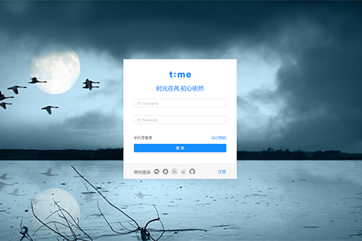
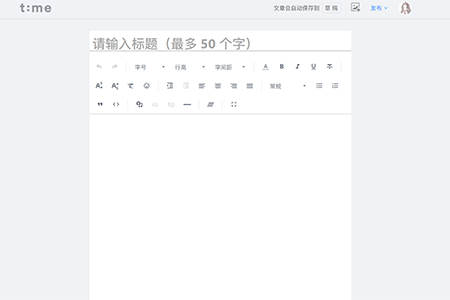
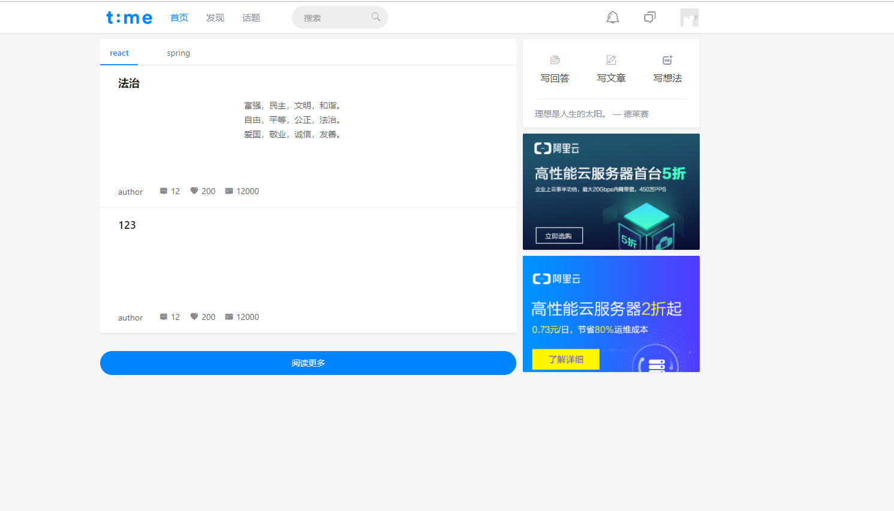

# my-react-blog

码云：

[后端springcloud](https://gitee.com/dy.huang/article-service)

[前端react](https://gitee.com/dy.huang/my-react-blog)

GitHub：

[前端react](https://github.com/huangdeyao/my-react-blog)

[后端springcloud](https://github.com/huangdeyao/article-service)

#### 项目介绍

react实现个人博客，关于CSS我是渣渣，不太会，样式我趴了[简书](https://www.jianshu.com/)和[知乎](www.zhihu.com)

一些小的组件UI 用了蚂蚁金服的antd

功能实现文章列表，写作，上传图片

基于这个项目我做了一个使用vue 实现的[个人小网站](https://www.yrclubs.com/home),样式基本类似，暂时未做开源

#### 软件架构

软件架构说明

安装的依赖有:
```
  "dependencies": {
    "antd": "^3.10.2",
    "axios": "^0.18.0",
    "braft-editor": "^2.1.29",
    "buffer": "^5.2.1",
    "expose-loader": "^0.7.5",
    "immutable": "^3.8.2",
    "react": "^16.5.0",
    "react-dom": "^16.5.0",
    "react-loadable": "^5.5.0",
    "react-redux": "^5.0.7",
    "react-router-dom": "^4.3.1",
    "react-scripts": "1.1.5",
    "react-sticky": "^6.0.3",
    "react-transition-group": "^2.4.0",
    "redux": "^4.0.0",
    "redux-immutable": "^4.0.0",
    "redux-thunk": "^2.3.0",
    "styled-components": "^3.4.6"
  },
  
```

#### 安装运行

1. npm install
2. npm start

#### 使用说明

需要启动后端服务

#### 样式



